# 💳 Bank Transaction Pattern Detection System

A data processing pipeline for ingesting and analyzing banking transaction data to detect actionable patterns using PySpark on Databricks, AWS S3, and PostgreSQL.

---

## 🧠 Project Overview

This pipeline monitors transactional data in near real-time, splits it into chunks, logs them to AWS services, and performs pattern detection using Apache Spark (via Databricks).

---
## Downloadables
A downloadable zip file is present in the notebook as ```bucket```.

## 📌 Use Case

The system is designed to detect the following customer behavior patterns:

1. **UPGRADE**  
   Customers in top 1% by transaction count and bottom 1% by customer importance (weight).  
   _Condition_: merchant transaction count > 50K

2. **CHILD**  
   Customers whose average transaction value is less than ₹23 and count ≥ 80.

3. **DEI-NEEDED**  
   Female customers with > 100 transactions and whose volume exceeds male customers.

---

## 🏗️ Architecture

```mermaid
flowchart TD
    subgraph Ingestion
        X1["📄 Google Drive: transactions.csv"]
        X2["📄 Google Drive: CustomerImportance.csv"]
        P1["🔁 Transaction Splitter (10,000-row chunks/sec)"]
        S3["☁️ AWS S3: /chunks"]
        DB["🗃️ PostgreSQL (RDS): Logging"]
        X1 --> P1
        P1 --> S3
        P1 --> DB
    end

    subgraph Detection
        D1["💻 Databricks Cluster"]
        DF["📄 CustomerImportance.csv -> DataFrame"]
        DETECT["🧠 Pattern Detector"]
        OUT["☁️ S3: /detections"]
        S3 --> D1
        X2 --> DF --> D1
        DB -.-> D1
        D1 --> DETECT --> OUT
    end

    DETECT --> P2["✅ Pattern 1: UPGRADE"]
    DETECT --> P3["✅ Pattern 2: CHILD"]
    DETECT --> P4["✅ Pattern 3: DEI-NEEDED"]
```



> 🔍 Note: Although Databricks Community Edition doesn’t support job scheduling, a job is depicted in the architecture to align with assignment requirements.

---

## 🧰 Tech Stack

| Tool | Role |
|------|------|
| **Databricks (CE)** | Spark processing & pattern detection |
| **PySpark** | Data transformation and detection logic |
| **AWS S3** | Input/output data storage (`/chunks`, `/detections`) |
| **AWS RDS PostgreSQL** | Logging processed chunks |
| **Google Drive** | Source of CSVs (`transactions.csv`, `CustomerImportance.csv`) |
| **VS Code** | Development and local data sync |

---

## 📁 Folder Structure

```bash
takehome/
├── bucket/
│   ├── s3_chunks/         # Synced from s3://banktransactionskrnl1/chunks/
│   └── s3_detections/     # Synced from s3://banktransactionskrnl1/detections/
├── notebooks/
│   ├── ingestion_notebook.py
│   └── pattern_detection_notebook.py
├── sql/
│   └── logging_table_schema.sql
└── README.md
```

---

## 🔄 Syncing Data from S3

Ensure the AWS CLI is installed and run:

```bash
aws s3 sync s3://banktransactionskrnl1/chunks/ "D:\takehome\bucket\s3_chunks"
aws s3 sync s3://banktransactionskrnl1/detections/ "D:\takehome\bucket\s3_detections"
```

---

## 📋 Status

- [x] Ingestion mechanism tested with `transactions.csv`
- [x] Logging integrated using AWS RDS PostgreSQL
- [x] Pattern logic implemented in Databricks using PySpark
- [x] Outputs successfully stored in `/detections` folder on S3
- [ ] Optional: Set up a job scheduler (not supported in CE)

---

## 🧑‍💻 Author

Harshini Aiyyer  
[GitHub](https://github.com/HarshiniAiyyer) • [LinkedIn](https://linkedin.com/in/harshini-aiyyer)
